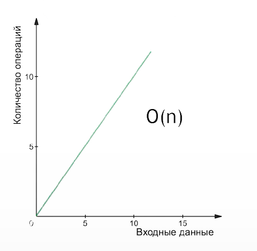

# Data Structures and Algorithms

> ***To understand the algorithm, you need to see it. Larry Wall***

Алгоритм - это последовательность команд, выполняемых для решения задачи.

В данном репозитории представлены примеры основных алгоритмов и структур данных.

Вы можете встретить подобные записи в файлах проекта *О(n)*, *O(log n)*, и т.д. 
Эти записи обозначают сложность выполниния алгоритма. 
Т.е. зависимость колличества операций от входных данных.

